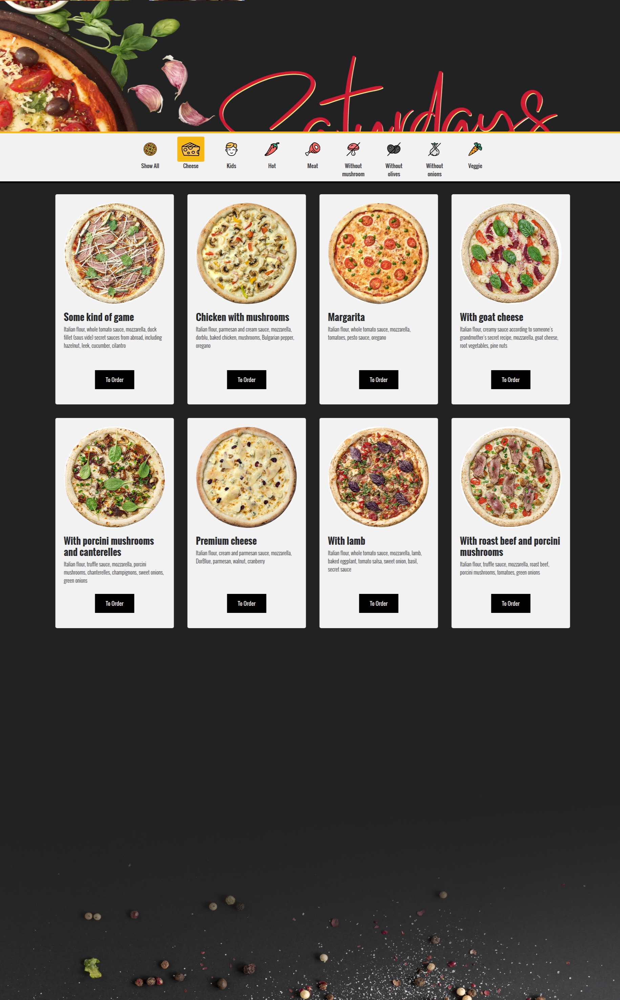

# Saturdays pizza

[](https://opensource.org/licenses/MIT) 

## **Author**: ```Brian Weloba```

## Description

This is a pizza ordering and delivery service that lets users order pizza and have them delivered at their homes.

The site was published on [GitHub Pages](htps://pages.github.com/).

## Page Preview



## Setup

 1. Clone this repository.
 2. Open the project directory.
 3. Run index.html on your browser.

- Alternatively, view on [GitHub Pages](https://brian-weloba.github.io/Saturdays-pizzeria/).

## BDD

Behavioral specifications:
>**Title**: Get Pizza

>**As** a user.  
>**I want to** Order a pizza and have it delivered to my home 
>**so** that I don't have to leave the house  

>**Scenario 1:** I live in Langata  
>**Given** that I order a pizza 
>**and** I want a medium pizza with a thick crust.
>**when** I select a pizza 
>**and** Choose the size base abd toppings 
>**then** I should get the toyal price 
>**and** get prompted to input delivery location.  

>**Scenario 2:** I live in Nakuru 
>**Given** that I order a pizza 
>**and** I choose my bade toppings and size
>**when** I checkout
>**and** I input my location
>**then** I should get a warning that im out of range

## Contact

E-mail: ```bweloba@gmail.com```

## Technologies Used

- HTML5
- CSS3
- Javascript
- Bootsrap4
- jQuery
- Git

## Legal

 Copyright &copy; 2020 Brian N Weloba
